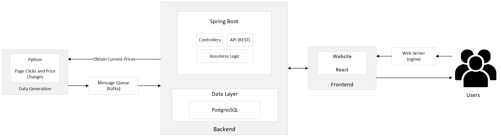

# Project abstract
### Board Games Hub
Web page with the intention of comparing board games prices across multiple web stores, providing their current price and showcase their historic lowest prices.

Software used:
* Frontend - Reactjs
* API - SpringBoot
* Backend - Postgresql
* Repository - Github 
* Backlog - Github
* Agile Board - Github

# Project team
* Team Manager: Pedro Pinho (109986)
* Product Owner: Bárbara Galiza (105937)
* Architect: João Andrade (107969)
* DevOps Master: Tomás Victal (109018)

# Architecture Diagram

# Bookmarks
